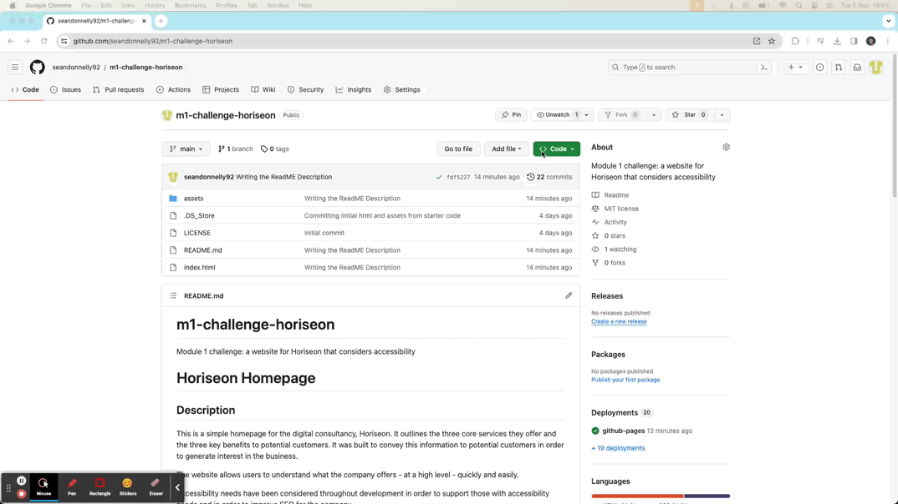

_This project was created for module 4 of the EdX Skills for Life Front End Development bootcamp. In this challenge, we were tasked with calculating some finances in the console log from a 2-dimensional array._

# Console Finances

## Description

If you open the console log in browser, it pulls out information from an array contained in index.js. This page was created to learn more about JavaScript. All data is fictional. 

I found this challenge to be the hardest so far but it has definitely been rewarding to get to grips with JS logic. 

**Here is the published website URL:** https://seandonnelly92.github.io/Console-Finances/

## Table of Contents (Optional)

If your README is long, add a table of contents to make it easy for users to find what they need.

- [Installation](#installation)
- [Usage](#usage)
- [Credits](#credits)
- [License](#license)

## Installation

You can see the live website by visting https://seandonnelly92.github.io/Console-Finances/

If you want to work on the software locally, here is one way of doing it

1. Go to https://github.com/seandonnelly92/Console-Finances/ 
2. Download the code repository by clicking the green 'Code' button and then 'Download Zip' as shown here

    

3. Navigate to your downloads folder an Unzip the repository folder. 
4. Move whole folder to a location where you want your project to be stored locally.
5. Open Visual Studio Code
6. Click File > Open Folder... 
7. Navigate to the location where you stored the repository
8. Select the folder
9. Click Open
10. Now you can work on the codebase locally! 

## Usage

Functionality is limited on the website, it mostly just displays information. The nav bar does contain five links: one is the logo which just redirects to the homepage. This will only be useful in future if other pages are added and the nav bar is updated. The other four links in the nav bar are internal anchor tags that scroll the relevant section on the homepage. 

Here is a screenshot of the live website: 
        

## Credits

Thank you to EdX Skills for Life team including Abdul and all of the TAs for their support so far. 

Thank you to https://realfavicongenerator.net/ for guidance on creating a favicon and for converting my image into multiple favicon files. 

## License

MIT License

Copyright (c) 2023 seandonnelly92

Permission is hereby granted, free of charge, to any person obtaining a copy
of this software and associated documentation files (the "Software"), to deal
in the Software without restriction, including without limitation the rights
to use, copy, modify, merge, publish, distribute, sublicense, and/or sell
copies of the Software, and to permit persons to whom the Software is
furnished to do so, subject to the following conditions:

The above copyright notice and this permission notice shall be included in all
copies or substantial portions of the Software.

THE SOFTWARE IS PROVIDED "AS IS", WITHOUT WARRANTY OF ANY KIND, EXPRESS OR
IMPLIED, INCLUDING BUT NOT LIMITED TO THE WARRANTIES OF MERCHANTABILITY,
FITNESS FOR A PARTICULAR PURPOSE AND NONINFRINGEMENT. IN NO EVENT SHALL THE
AUTHORS OR COPYRIGHT HOLDERS BE LIABLE FOR ANY CLAIM, DAMAGES OR OTHER
LIABILITY, WHETHER IN AN ACTION OF CONTRACT, TORT OR OTHERWISE, ARISING FROM,
OUT OF OR IN CONNECTION WITH THE SOFTWARE OR THE USE OR OTHER DEALINGS IN THE
SOFTWARE.